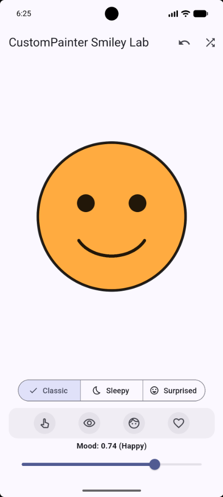
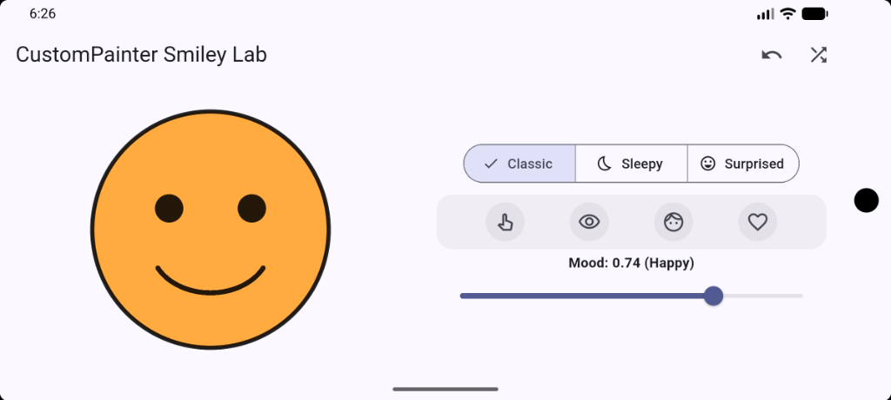
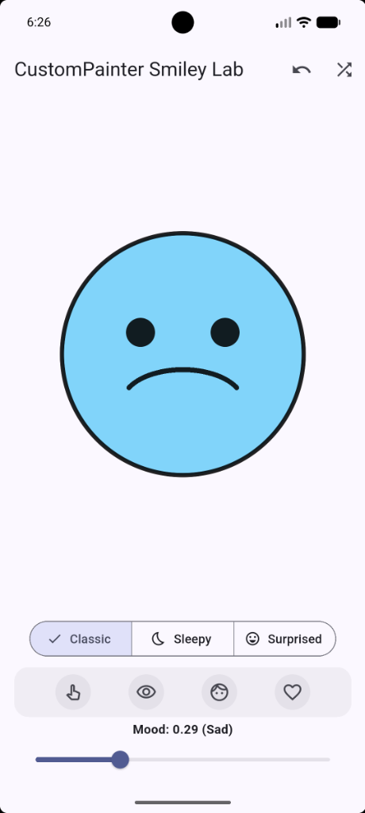
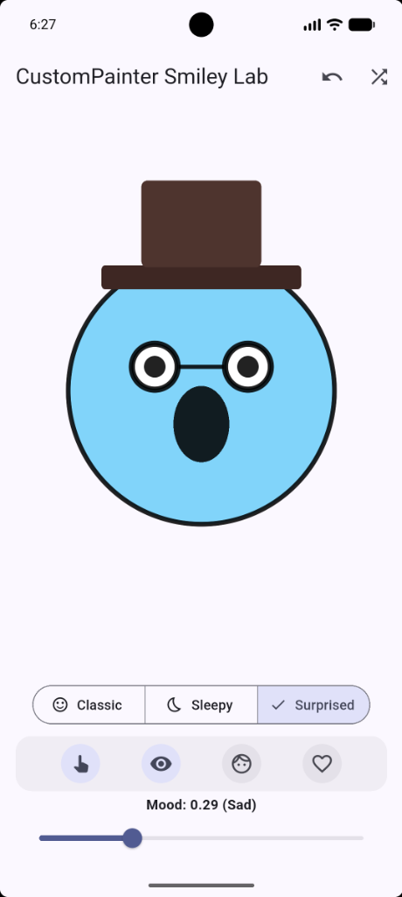
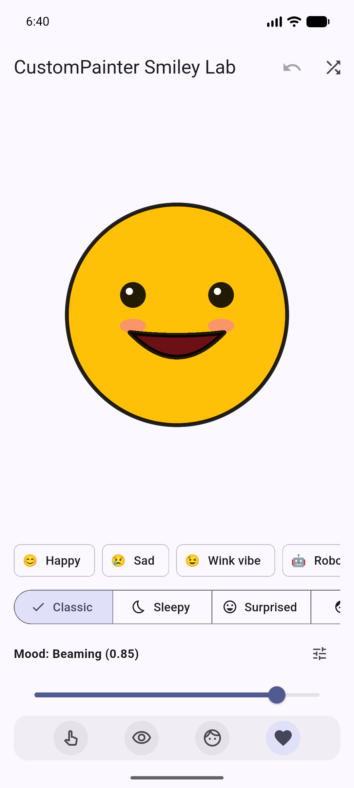

# In-Class Activity 06 — Critical Thinking Gauntlet

**Student:** Adi Tauqir  
**Course:** Mobile Application Development  
**Date:** September 30, 2026  
**Track:** Undergraduate Track (with Bonus Challenges)

---

## Part 1: Undergraduate Response — Measure and Improve Your Smile Arc

To keep the smiley face and its smile arc well-balanced and responsive across varying screen sizes and orientations, all coordinates are derived dynamically from the canvas dimensions rather than fixed pixel offsets. The face center is calculated as `c = Offset(size.width / 2, size.height / 2)` and the baseline radius as `r = size.shortestSide * 0.40`. The mouth bounding rectangle is computed using `Rect.fromCenter(center: Offset(c.dx, c.dy + r * 0.15), width: r * 1.0, height: r * (0.40 + mood * 0.50))`, with a clockwise sweep angle of `0.70 * pi` radians starting at `0.15 * pi` for smiles and `1.15 * pi` (translated down by `r * 0.25`) for frowns. When tested on the Android phone emulator in both portrait and landscape modes, the face scaled smoothly with zero `RenderFlex` overflow errors because the layout uses an `OrientationBuilder` with adaptive Row/Column positioning and scales every component (eyes, stroke widths, mouth, and accessories) strictly as fractional multiples of `r` and `size.shortestSide`. Lastly, `shouldRepaint` is implemented to return `true` only when active input properties (`mood`, `faceType`, `faceColor`, `showHat`, `showGlasses`, `showMustache`, or `showBlush`) change, preventing redundant and costly canvas re-rasterization when the widget rebuilds without state changes.

---

## Evidence Artifacts (Phone Emulator Screenshots)

### Figure 1: Classic Happy Smiley in Portrait Mode


### Figure 2: Responsive Landscape Mode (No Overflows)


### Figure 3: Mood Slider and Color Band Logic (Sad / Frown at Mood 0.29)


### Figure 4: Bonus Accessories & Surprised Style (Hat + Glasses)


### Figure 5: Module 3 Recreated Look (Beaming Expression, Catchlights, Blush & Open-Mouth Fill)


---

## Part 2: Bonus / Graduate Deep Dive — When Should a Painter Repaint?

### Comparison: `always true` vs. Comparing Painter Fields

1. **Always Returning `true` (`return true;`):**
   - Whenever any parent widget rebuilds (for example, on unrelated layout changes, animation ticks elsewhere in the widget tree, or parent state updates), Flutter unconditionally clears and re-invokes `paint(Canvas, Size)`.
   - **Observation:** In Flutter DevTools and profiling monitors, CPU and GPU frame workloads spike unnecessarily because identical canvas drawing commands (circles, arcs, paths) are re-executed repeatedly even when no painter input changed.

2. **Comparing Painter Inputs (`oldDelegate.config != config || oldDelegate.faceColor != faceColor`):**
   - Flutter compares the fields of the previous painter instance with the new painter instance before issuing a repaint request.
   - If no fields changed, Flutter reuses the existing rasterized layer directly from the compositing cache, resulting in **0 ms redraw time**.
   - **Observation:** When moving sliders or interacting with other UI controls, only meaningful state changes trigger `paint()`, preserving silky-smooth 60/120 fps frame rates and conserving device battery.

### Recommendation
Our application maintains a comprehensive `FaceConfig` data class alongside the dynamic `faceColor` and `eyeRadius`. The app strictly uses the field comparison pattern:
```dart
@override
bool shouldRepaint(covariant SmileyPainter oldDelegate) {
  return oldDelegate.config.mood != config.mood ||
      oldDelegate.config.faceType != config.faceType ||
      oldDelegate.config.showBlush != config.showBlush ||
      oldDelegate.config.showHat != config.showHat ||
      oldDelegate.config.showGlasses != config.showGlasses ||
      oldDelegate.config.showMustache != config.showMustache ||
      oldDelegate.faceColor != faceColor;
}
```
This guarantees that changes to mood, face style, or accessories trigger immediate, reactive visual updates, while non-drawing events avoid wasteful repaints.

---

## Part 3: Bonus — Accessories & Undo Stack Implementation

- **Accessories Implemented:**
  - **Hat:** Structured using `drawRRect` for the brim and crown, positioned above the head.
  - **Glasses:** Drawn using two circular frames over the eye coordinates connected by a bridge `drawLine`.
  - **Mustache:** Built with smooth Bézier curves using `drawPath` and `quadraticBezierTo`.
  - **Blush:** Semi-transparent pink ovals using `drawOval`.
- **Undo History:** Maintained via an immutable `FaceConfig` model stored in a `List<FaceConfig> _undoStack`. Each interactive alteration pushes the preceding configuration, and tapping the AppBar **Undo** button seamlessly restores the prior state with interactive `SnackBar` user feedback.
